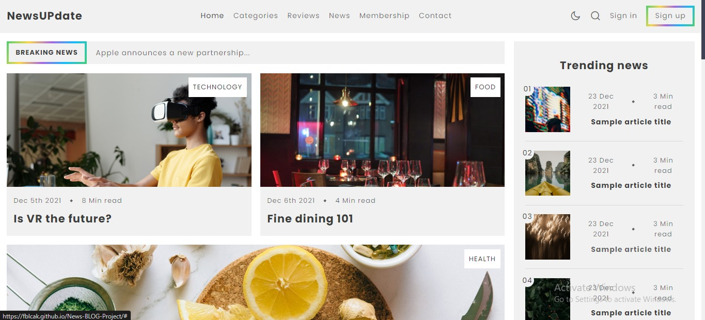

# News-BLOG-Project

News-BLOG-Project
  is a fully responsive blog website, responsive for all devices, built using HTML, CSS, and JavaScript.

## Demo




## Prerequisites

Before you begin, ensure you have met the following requirements:

* [Git](https://git-scm.com/downloads "Download Git") must be installed on your operating system.

## Installing

To install **News-BLOG-Project**, follow these steps:

Linux and macOS:

```bash
sudo git clone https://fblcak.github.io/News-BLOG-Project/
```

Windows:

```bash
git clone https://fblcak.github.io/News-BLOG-Project/
```

## Contact

Am always available for collaboration , If you want to contact me you can reach me at [Twitter](https://www.twitter.com/Freddyblcak),[Instagram](https://www.instagram.com/freddyalabaster),[Facebook](https://www.facebook.com/FrederickKojoAdzoho)

## License

This project is **free to use** and does not contains any license.
